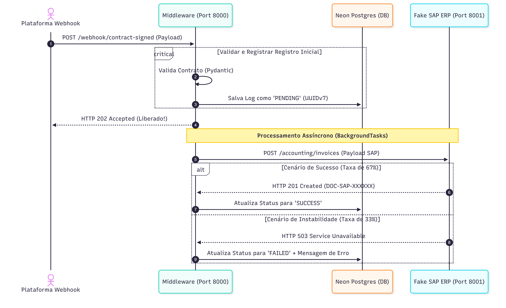

<p align="center">
  
  
  
  
  
  
</p>

<h2 align="center">✨ Clicksign to SAP Integration Middleware ✨</h2>

<p align="center">
  Este projeto representa um middleware de integração robusto, resiliente e de alta performance, meticulosamente desenvolvido para orquestrar o fluxo de dados contábeis e de faturamento contido em contratos digitais entre a Clicksign e o ecossistema SAP ERP (Módulos FI/SD). A arquitetura é totalmente desacoplada e dividida em duas aplicações independentes que se comunicam via chamadas HTTP assíncronas. O core do middleware recebe os webhooks de contratos assinados e responde imediatamente com o status <code>202 Accepted</code>, delegando o processamento pesado e as regras de comunicação externa para trabalhadores em segundo plano (BackgroundTasks). Toda a camada de auditoria e persistência transacional é gerenciada assincronamente pelo SQLModel (sobre SQLAlchemy 2.0 e driver Psycopg 3), utilizando identificadores globais ordenados por tempo (UUIDv7) para mitigar a fragmentação de índices B-Tree na nuvem distribuída do Neon Postgres. Para simulação e testes de estresse em ambiente de desenvolvimento, o ecossistema conta com um servidor SAP Fake embarcado que mimetiza oscilações de rede contendo uma taxa randômica de 33% de indisponibilidade (HTTP 503), forçando o middleware a operar sob rigorosos critérios de tolerância a falhas.
</p>

---

## 🏗️ Arquitetura e Fluxo do Sistema

O diagrama de sequência abaixo detalha o ciclo de vida completo de uma requisição, ilustrando o desacoplamento entre o recebimento do sinal da plataforma de assinaturas e a efetivação assíncrona do faturamento no ERP:



---

## 🔥 Features

- ⚡ **Desacoplamento Assíncrono**: Resposta imediata ao cliente (`HTTP 202`) e execução paralela de cargas de trabalho via `BackgroundTasks` nativas.
- 🗄️ **Indexação Otimizada via UUIDv7**: Chaves primárias auto-ordenáveis por tempo, otimizando a paginação e performance de busca em estruturas **B-Tree** no banco de dados.
- 🛡️ **Validação Rígida com Pydantic**: Contratos de entrada (DTOs) sanitizados na borda da aplicação, prevenindo injeções de dados corrompidos.
- 🏢 **Simulador SAP Embarcado**: Servidor mock independente reproduzindo estruturas de respostas complexas de faturamento e auditoria (`DOC-SAP-XXXXXX`).
- ⚡ **Driver de Dados de Última Geração**: Utilização do driver assíncrono `Psycopg 3` acoplado ao `async_sessionmaker` para alta concorrência concorrente.
- 💥 **Simulação Probabilística de Caos**: Injeção randômica de erros de infraestrutura (`HTTP 503 Service Unavailable`) com 33% de recorrência para validação de estabilidade.
- 🪵 **Telemetria de Produção Limpa**: Desativação estratégica do echo bruto de metadados SQL no motor, isolando o console exclusivamente para logs de negócio e eventos de rede.

---

## 📺 Demonstrações em Vídeo (Resultados dos Testes)

Abaixo estão as gravações em vídeo de cada um dos cenários de teste sendo executados em tempo real, validando o comportamento do middleware contra as regras do Pydantic e as falhas do SAP.

<table align="center">
  <tr>
    <td align="center" width="50%"><b>1. Cenário de Sucesso (Happy Path)</b></td>
    <td align="center" width="50%"><b>2. Erro de Validação (Valor Negativo)</b></td>
  </tr>
  <tr>
  <td>
  <video src="https://github.com/user-attachments/assets/77c27b2a-14d7-4de4-84e9-13497b5e9e94" width="100%" controls></video>
</td>
    <td>
      [Placeholder: Gravando bloqueio Pydantic gt=0 HTTP 422]
    </td>
  </tr>
  <tr>
    <td align="center"><b>3. Erro de Validação (Company Code Inválido)</b></td>
    <td align="center"><b>4. Teste de Resiliência (Falhas Aleatórias SAP 503)</b></td>
  </tr>
  <tr>
    <td>
      [Placeholder: Gravando bloqueio Pydantic max_length HTTP 422]
    </td>
    <td>
      [Placeholder: Gravando captura de erro 503 e persistência de falha]
    </td>
  </tr>
</table>

*(Nota: Você pode atualizar os caminhos e arquivos da tabela acima conforme gerar os prints reais na sua pasta img/)*

---

## 🛠️ Setup & Run

Para inicializar todo o ecossistema localmente, siga os passos abaixo dividindo a execução em dois terminais separados no seu ambiente virtual (`venv`):

### 1. Inicializar o Servidor Mock (SAP Fake)
```bash
# Navegue até a pasta do simulador SAP
cd SAP_fake

# Inicialize o servidor Uvicorn na porta 8001
uvicorn app.main:app --port 8001 --reload
